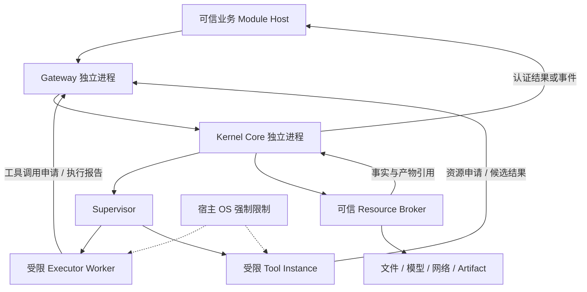

# Kernel 模块架构草稿

> 历史方案说明（2026-09-30）：本文保留早期讨论，不再作为当前架构或 M1 实施要求。
> 当前设计以 [Kernel](../Architecture/module/Kernel.md)、[Execution](../Architecture/module/Execution.md)
> 和 [架构指南](../Architecture/README.md) 为准：Ubuntu LTS、租约快速路径、五组件 Kernel、
> 独立 Execution 及 Tool 内 Executor 序列。文中的 Windows 优先、双进程 M1、旧组件归属等
> 均是历史提案。本轮未验证原型或增加 M1 承诺。下文旧文档名的链接已指向现行承接文档，
> 仅用于导航，不表示历史描述等同于承接文档的当前内容。


> 文件：`KernelModuleReport_Draft.md`  
> 状态：讨论草稿，供 Kernel 负责人主导评审；尚未成为全项目规范  
> 日期：2026-09-26  
> 范围：Kernel 权限与执行架构、建议实现路径、整体架构协同意见  
> 写入边界：本次仅创建本文，不修改其他文档、代码、配置或依赖

## 0. 阅读方式与决策状态

本文先解释安全边界，再定义进程、对象、协议和生命周期，最后给出可行性论证与协同修改清单。首次阅读建议按第 1、3、4、6、8、15、17 章建立全貌，再查阅其他章节。

当前项目仍处于文档设计阶段。现有代码和其他设计文档是协作背景，不是限制本提案的硬约束。本文发现的冲突仅在第 17 章提出修改建议；须经相关负责人协同后，才更新全项目规范与实现。

本文使用三种决策状态：

| 标记 | 含义 |
|---|---|
| **已确认原则** | 项目负责人在讨论中明确提出或接受的方向 |
| **建议默认** | 根据负责人授权补齐的具体方案，可在评审中调整 |
| **待验证** | 依赖原型、平台行为、故障注入或团队协同，不能当作已实现事实 |

文中的“必须”“不得”描述本方案成立所需的条件，不表示其他项目文档已经接受这些要求。对象名、状态名和字段是概念草案，不是已冻结的公共 schema。

### 0.1 目录

- [1. 架构摘要](#1-架构摘要)
- [2. 已确认原则与建议默认](#2-已确认原则与建议默认)
- [3. 威胁模型与安全边界](#3-威胁模型与安全边界)
- [4. 进程与部署架构](#4-进程与部署架构)
- [5. Kernel 内部职责](#5-kernel-内部职责)
- [6. 身份、权限与执行许可](#6-身份权限与执行许可)
- [7. 对外服务与输入依赖](#7-对外服务与输入依赖)
- [8. 系统调用与执行生命周期](#8-系统调用与执行生命周期)
- [9. 工具注册与不可信执行](#9-工具注册与不可信执行)
- [10. 撤销、中断、异常与 panic](#10-撤销中断异常与-panic)
- [11. 启动、关闭与恢复](#11-启动关闭与恢复)
- [12. 数据权限、产物与结果可信度](#12-数据权限产物与结果可信度)
- [13. 通信、幂等与资源限制](#13-通信幂等与资源限制)
- [14. 条件性安全论证](#14-条件性安全论证)
- [15. 实现可行性与原型验证](#15-实现可行性与原型验证)
- [16. M1 建议实现路线](#16-m1-建议实现路线)
- [17. 对整体架构的兼容性修改意见](#17-对整体架构的兼容性修改意见)
- [18. 十四项安全问题的处理映射](#18-十四项安全问题的处理映射)
- [19. 待评审事项与交付标准](#19-待评审事项与交付标准)
- [20. 参考依据](#20-参考依据)

## 1. 架构摘要

Kernel 是应用层的权限与执行控制核心。它不替代宿主操作系统，不需要修改 OS 系统调用实现，也不负责判断业务任务是否完成。

本方案的主线是：

```text
可信 Module 身份
  → 代表 AgentRun 的委派关系
  → Gateway 认证、过滤和限流
  → Kernel 按当前权威状态授权
  → 为具体执行实例签发受限许可
  → 在真实资源访问点落实权限
  → 校验结果、记录效果并通知调用方
```

门禁通过只表示请求可以进入 Kernel；工具完成只表示物理执行产生了结果；Kernel 接受结果也不等于 Workflow 的业务任务成功。

系统采用两种不同强度的保障：

1. **可信业务 Module**：依靠代码纪律、公开协议与开发检查，不主动绕过 Kernel。
2. **Executor 与用户工具**：按可能失控处理，需要受限进程、受控 IPC、最小资源权限和可信资源代理。不能依赖它们主动遵守令牌校验。

Kernel Core 与 Gateway 至少分为两个独立进程。其他进程按权限与信任关系划分，不与五个一级 Module 机械地一一对应。

## 2. 已确认原则与建议默认

### 2.1 已确认原则

| ID | 原则 |
|---|---|
| C-01 | 可信 Module 不执行绕过 Kernel 的受保护资源访问代码。 |
| C-02 | 可信 Module 不动态修改 AgentOS 开发者提供的程序。 |
| C-03 | Kernel 与门禁是两个独立进程。 |
| C-04 | 权限默认拒绝，由 Kernel 维护；门禁负责认证和明显非法请求的前置拦截。 |
| C-05 | 启动时为 Module 建立密钥或等效凭据；转发保留原始主体。 |
| C-06 | 权限基本视图为 Agent 可使用的工具集合，可向 Kernel 申请变更。 |
| C-07 | 执行前后检查权限有效性，异常时采用回滚或其他处理。 |
| C-08 | Executor 不视为完全可信，应缩减权限并要求执行许可。 |
| C-09 | 工具是独立服务，支持扩展注册；用户可以编写工具，需额外防范。 |
| C-10 | 通过门禁守护、启动顺序、重启恢复、数据权限继承和请求阈值完善安全机制。 |
| C-11 | 内部开发错误破坏安全不变量时，可触发系统级 panic；具体安全停机流程需定义。 |
| C-12 | 架构调整先写入 Kernel 文档提案，不能直接修改其他项目内容。 |

### 2.2 本文补齐的建议默认

- 将 C-07 细化为“执行前准入、真实权限使用点检查、结果提交校验”。事后检查不承诺撤销既成效果。
- Module 凭据按实例生成；AgentRun 是逻辑主体，通过 RunDelegation 绑定，不要求每个 Agent 持有独立私钥。
- 采用 Kernel 在线校验的不透明许可 ID，绑定接收服务、实例身份、UnitAttempt、资源和版本；单纯知道许可 ID 不足以使用它。
- 使用最小 Supervisor 和可信 Resource Broker；用户工具不能成为自己的唯一权限检查者。
- 默认每次不可信工具执行使用独立实例，第一版不支持跨运行共享长驻状态。
- 撤销默认阻止新操作，并尽力终止在途执行；补偿属于新的受控动作。
- 重启产生新 bootEpoch；恢复业务与执行记录，重新建立临时身份和授权。
- 门禁缓存不承担最终安全保证；Kernel 始终进行最终授权。
- 普通非法请求返回错误；只有内部安全不变量破坏进入 panic。

上述具体方案属于可修改的设计选择，不伪称为已经逐项确认的最终决策。

## 3. 威胁模型与安全边界

### 3.1 信任与不信任对象

| 对象 | 假设 | 保障范围 |
|---|---|---|
| 宿主 OS、安装来源、可信启动环境 | 正确运行，未被管理员或攻击者控制 | 作为隔离与初始信任基础 |
| Kernel Core、Supervisor、可信资源代理 | 实现正确，代码与配置受到保护 | 属于可信计算基 TCB |
| Gateway | 正确认证与转发；Kernel 不把其预检查当最终授权 | 属于 TCB，但不给它通用资源执行权 |
| UserInteraction、Workflow、ContextEngine、Catalog 等可信业务 Module | 不主动绕过 Kernel、不修改系统程序；仍可能提交错误请求 | 采用逻辑边界与输入校验 |
| Executor、用户工具与其依赖 | 可能恶意、失控、超量调用、伪造输出或启动子进程 | 必须使用外部强制边界 |
| 模型输出、仓库文本、工具返回 | 不可信数据，不是系统指令或授权依据 | 校验、来源记录与业务验收 |

可信业务 Module 被攻破并执行任意代码，不在当前逻辑隔离承诺内；未来若需要防御，应将其迁入受限制的保护域。Executor 与用户工具从一开始不享有这一信任假设。

### 3.2 保护对象

权限控制针对明确资源，而不是试图代理进程运行所需的全部 OS API：

- 仓库文件、其他运行的 workspace 与临时数据。
- 模型凭据、身份密钥、执行许可和 Kernel 内部状态。
- 网络访问、工具启动、进程控制和可消耗的模型额度。
- Artifact、日志、错误诊断及派生报告。
- 授权策略、运行委派、执行记录和工具版本。

允许进程具有运行时必需的基础能力，但不得由此获得未声明的受保护资源访问能力。

### 3.3 不承诺的保证

- 不宣称“独立进程”“黑箱”或令牌本身带来绝对安全。
- 不防御已控制宿主 OS 或管理员权限的攻击者。
- 不把文件 hash 检查当作进程内存完整性证明。
- 不承诺撤回已经读取或发送的数据，也不承诺任意外部效果 exactly-once。
- 不因工具有签名、通过注册或 schema 合法，就认定其行为或结论可信。
- 不承诺一般意义上的完全信息流隔离或消除所有侧信道。授权工具获得数据后，其输出和可访问目标仍需限制。

### 3.4 核心概念

| 概念 | 本文含义 |
|---|---|
| Principal，安全主体 | 可认证并承担权限的用户、Module 实例、Executor 或工具实例 |
| Protection Domain，保护域 | 共享资源可见范围和权限约束的执行环境 |
| Trust Boundary，信任边界 | 穿越后必须验证主体、请求或数据的边界 |
| TCB，可信计算基 | 正确性直接影响安全保证的组件集合 |
| Reference Monitor，参考监控器 | 对受保护访问进行不可绕过的检查机制；本文由 Kernel、资源代理与 OS 限制共同实现 |
| Delegation，委派 | 允许主体代表某次运行行动，且不得扩大上级权限 |
| ExecutionPermit，执行许可 | 绑定实例、操作、资源与有效条件的短期授权 |
| Reconciliation，效果核对 | 确认外部动作实际是否发生，解决状态未知 |

## 4. 进程与部署架构

### 4.1 进程职责

| 进程 | 职责 | 不负责 |
|---|---|---|
| Supervisor | 可信启动、实例登记引导、隔离配置、进程树监管、终止、完整性检查 | 不规划任务，不自行授予业务权限 |
| Kernel Core | 权限权威、许可、预算、Attempt、撤销、效果记录、结果接受与投影 | 不加载用户代码，不直接相信执行器结果 |
| Gateway | 认证、协议检查、入口限流、防重放、前置过滤与转发 | 不签发最终执行许可，不持有全部资源凭据 |
| 可信 Module Host | 装配可信业务 Module，保留各模块逻辑状态所有权 | 不成为权限代理或执行旁路 |
| Resource Broker 进程组 | 以窄接口完成文件、模型、网络和产物操作 | 不执行任意用户插件，不自行扩大授权 |
| Executor Worker | 接收受限执行任务，协调工具并报告进展 | 不选择更宽的隔离配置，不持有通用进程启动或宿主访问权 |
| Tool Instance | 执行固定版本工具，处理显式输入并提交输出 | 不直读 Kernel 数据、其他运行数据或宿主凭据 |

Resource Broker 是逻辑分组。文件和持密钥的模型代理建议分开保护；实际进程数量按最小权限与性能测试决定。Supervisor 与 Broker 是 Kernel 运行支撑，不新增领域一级 Module。



图示控制路径不要求大对象逐字节通过门禁。经 Kernel 准入可以建立范围受限的数据通道；通道必须绑定端点、运行、额度与生命周期，不能形成任意资源访问旁路。

### 4.2 外部入口与内部控制通道

- Module、Executor、Tool 向 Kernel 发起服务请求，只能通过 Gateway。
- Kernel 与 Supervisor、Broker 的内部通道在可信启动阶段建立，不向普通 Module 暴露。
- Broker 校验许可及报告资源效果，使用受保护的内部通道；它是参考监控机制的一部分，不是普通工具的直连特例。
- Kernel 可以通过已认证、绑定接收方的返回通道直接通知调用者；不得接受通知接收方借此发起未授权控制调用。
- 内部端点依靠访问控制和认证保护，不依靠隐藏端口、文件名或不公开文档。
- 运行通道、控制通道和大对象传输应有有界队列，避免单条阻塞请求阻止取消。

### 4.3 最小权限部署

Kernel 默认不以管理员/root 身份运行。平台隔离若需要特权辅助组件，应缩小其命令集合并单独评审，而不是把整个 Kernel 升权。

可信启动器建立 OS 身份、受限令牌、句柄继承和 IPC 访问规则。用户工具不能自行选择脱离沙箱、扩大网络或宿主挂载范围。隔离能力不满足时拒绝运行该类工具。

## 5. Kernel 内部职责

以下是职责划分，不预设一个职责对应一个类或独立服务。

| 组件职责 | 管理内容 |
|---|---|
| Identity and Delegation | ModuleInstance、受认证会话、RunDelegation、实例撤销 |
| Policy Authority | 默认拒绝、工具与资源授权、策略版本、授权变更 |
| Admission and Permit | 准入顺序、预算预留、执行许可、使用点验证 |
| Execution Coordinator | UnitAttempt、可信启动指令、执行结果汇总与取消 |
| Resource Accounting | 调用数、token、并发、输出限额、预留与结算 |
| Effect and Recovery | 效果记录、状态核对、恢复准入与补偿请求 |
| Runtime Projection | 汇总 Workflow 业务事实与 Kernel 执行事实，输出脱敏视图 |
| Audit | 记录请求、决策、许可、使用、撤销、结果与异常 |

Kernel 保留 UserInteraction、Workflow、ContextEngine、AgentToolPool 各自的业务状态所有权。可信资源代理读取文件不意味着接管检索排序；Kernel 记录执行效果不意味着接管 Workflow 的业务补偿规划。

## 6. 身份、权限与执行许可

### 6.1 Module 实例身份

建议每次启动生成独立的实例凭据，避免开发者把共享密钥硬编码进源码。凭据通过受保护的初始化通道交付，不能出现在命令行、普通日志或所有 Module 共享的配置中。

启动时生成与运行期持续轮换是两件事；第一版先支持实例重建时失效，不要求复杂的在线轮换。

可选择每实例随机秘密建立受认证会话，或实例密钥对加受信任登记。不得自创密码算法。Kernel 保存身份映射和必要验证材料，不要求保存所有实例私钥。若使用对称秘密，Gateway 所需验证材料的获取和保管也纳入 TCB 设计。

身份认证证明“谁发来请求”，不证明请求自报的 Agent、运行和参数正确。

### 6.2 RunDelegation：代表运行的权利

建议概念记录：

| 字段组 | 含义 |
|---|---|
| delegationId、version | 委派身份及版本 |
| moduleInstanceId | 被允许发请求的实例 |
| workflowRunId、agentRunId | 可以代表的运行和 Agent |
| allowedOperations | 提交 Unit、查询所属执行等控制能力 |
| scopeRef | 用户授权与运行权限上限的引用 |
| bootEpoch、status、expiry | 生命周期约束 |

登记流程：用户创建意图经 Kernel 准入 → Workflow 创建业务对象 → Workflow 通过受认证请求登记归属 → Kernel 验证所属运行与允许的登记者 → 建立委派。

Workflow 的登记不能创造新的用户授权，也不能通过修改 Agent ID 或 permission 字段扩大范围。可信 Module 可代表哪些运行应显式限定。

Executor 和工具只获得具体 UnitAttempt 的委派，不获得代表整个 AgentRun 任意行动的资格。

### 6.3 权限模型

保留负责人提出的直观视图：

```text
AgentRun → 工具集合
```

实际判断需增加每个工具的资源、动作和限制：

```text
AgentRun A
  read_file：Workspace X，read，单次输出上限
  model_call：Model Y，invoke，输入数据范围与运行预算
```

此外单独管理主体控制权限，例如创建运行、取消所属运行、注册工具、申请授权变更。它们不能全部塞进 Agent 工具列表。

有效权限同时受用户授权、Module 委派、运行范围、Agent 工具规则、工具启用上限与当前许可约束；任一维度拒绝则拒绝。多个约束取更严格结果，不通过合并形成隐式扩权。

### 6.4 ExecutionPermit

建议第一版采用不透明随机许可 ID，Kernel 保存权威记录并在线验证：

| 绑定信息 | 目的 |
|---|---|
| permitId、parentPermitId | 许可身份与委派父链 |
| bootEpoch | 拒绝旧启动代次的许可 |
| holderInstanceId | 绑定实际 Executor / Tool 身份，不能仅凭 ID 使用 |
| audience | 绑定目标工具或资源代理 |
| agentRunId、unitAttemptId | 防止跨运行、跨执行复用 |
| definitionRef、digest | 固定实际执行的工具版本 |
| resourceScope、action | 限制访问资源及动作 |
| requestDigest / parameterConstraints | 防止批准后替换参数；动态子请求只能落在明确允许范围内 |
| relevantPolicyVersion、revocationEpoch | 核对相关授权有效性 |
| expiry、usageLimits、status | 约束时间、次数、大小与生命周期 |

父许可只允许派生相同或更小范围的子许可。父许可撤销后，子许可不能继续申请新动作。单次消费、允许多次资源读取等语义由动作类型明确，不把所有许可一律设计成无限复用或一次性。

许可验证必须与预算预留或次数消费形成原子判定，避免并发请求各自看到同一剩余额度后超量使用。

### 6.5 Gateway 与 Kernel 的权限一致性

Gateway 持有带版本的过滤快照，Kernel 是唯一最终权限权威：

- Gateway 认为允许，Kernel 已撤销：Kernel 拒绝。
- Gateway 认为拒绝，但快照可能过期：刷新或转交 Kernel 确认；不得长期把缓存误拒当权威结论。
- schema 非法、认证失败、消息超限等可直接拒绝。
- Kernel 不可达时，新受保护动作失败关闭，不旁路执行。

不追求门禁每次都拥有“绝对最新权限表”；缓存新鲜度影响前置过滤效率与可用性，不承担最终安全保证。

## 7. 对外服务与输入依赖

### 7.1 Kernel 提供的服务

| 调用方 | 服务 | 输出与边界 |
|---|---|---|
| UserInteraction | 创建、查询、报告、取消及后续控制 | 控制处理结果、RuntimeProjection、报告引用；业务终态由 Workflow 决定 |
| Workflow | CONTEXT、MODEL、FILE_READ 等 Unit 执行 | 已校验 UnitResult、执行事件、usage 和诊断 |
| Workflow / 用户控制入口 | 委派登记、权限变更申请 | 明确批准或拒绝；登记不等于扩权 |
| Executor / Tool | 使用许可申请资源、提交候选结果 | 受控资源结果或拒绝；不直接持有通用凭据 |
| 工具管理入口 | 注册、启用、禁用、撤销 | 注册结果与能力状态；注册不自动授权 |
| Supervisor / Module Host | 生命周期、健康与停止协调 | 准备就绪状态、受限启动计划与清理结果 |

### 7.2 Kernel 必需的输入

| 来源 | 输入 | 用途 |
|---|---|---|
| UserInteraction | UserIntent、PromptRevisionRef、workspace 请求、目标运行、原因 | 表达用户操作；不直接当作已授权事实 |
| Workflow | UnitIntent、运行归属、GraphRevision、MissionScope 快照、固定定义集合、业务视图与控制事件 | 核对请求和业务状态，形成运行投影 |
| AgentToolPool | DefinitionVersion、digest、契约引用、工具能力需求与状态 | 固定执行版本并检查兼容与启用状态 |
| ContextEngine | ContextPack、来源、revision、token 统计和错误 | 校验上下文输出及范围 |
| Resource Broker | 真实资源操作结果、可观测 usage、效果记录、ArtifactRef | 作为执行事实依据 |
| Executor / Tool | 状态报告、候选输出、声明用量、错误 | 不可信输入；需要与代理及监管事实交叉核对 |
| Supervisor | 实例身份、启动证明、退出状态、资源与进程树观测 | 判断进程生命周期，不作为业务成功证明 |
| Persistence / Artifact / Registry | 记录、不可变产物、schema 与完整性结果 | 支撑授权、校验、审计与恢复 |

Kernel 不直接读取 Workflow 私有表来核对运行归属。需新增公开、版本化的约束快照或查询接口；这是第 17 章的协同项。

### 7.3 输入契约建议

- 请求体中的 claimed identity 与 Gateway 附加的 authenticated identity 分开保存，不允许调用方覆盖认证字段。
- `input` 与 `inputRef` 对需要输入的操作明确互斥；每个工具 schema 规定所需形式，不允许两者缺失而靠猜测。
- 根据 execution kind 与固定定义解析输入输出 schema，不能停留在 `unknown` 外壳校验。
- 原始消息保留关联与摘要；验证、规范化后形成不可变执行请求。授权与执行绑定同一个规范化参数摘要，避免不同解析器产生不同含义。
- 统一携带 requestId、correlationId、适用运行身份、deadline 和协议版本；未知版本明确拒绝。

## 8. 系统调用与执行生命周期

### 8.1 交互概念

| 类型 | 定义 | 示例 |
|---|---|---|
| AgentOS 系统调用 | 主体主动请求受保护服务 | 读取、模型调用、取消、申请权限 |
| 控制信号 / 中断请求 | 要求改变在途过程，不等于硬件抢占 | 撤销、暂停、deadline 到达 |
| 异常 / 故障 | 请求或执行偏离契约，需要分类处理 | 权限拒绝、超时、工具崩溃 |
| 完成事件 / Result | 正常完成及其输出 | 文件读取结果、模型响应 |

四类不是绝对互斥：取消可先由系统调用提交，再转为中断请求；异常也可异步上报。它们是应用协议语义，不声称存在 CPU 特权态切换。

### 8.2 执行前准入

建议顺序：

```text
入口大小与协议检查
  → 通信主体认证
  → 请求幂等识别
  → Module—AgentRun 委派核对
  → 当前运行、revision、工具定义与参数核对
  → 资源与权限判断
  → 预算预留、并发准入
  → 创建 UnitAttempt 并记录执行意图
  → 签发许可、请求 Supervisor 启动或绑定实例
```

前置拒绝生成 AdmissionDecision / AuditRecord，不创建虚假的“已经执行”记录。准入后创建的 UnitAttempt 可以记录启动失败，二者应在报告中区别显示。

### 8.3 真实权限使用点

工具服务需要资源时携带自身身份与许可，经 Gateway 请求 Kernel。Kernel 核验并指令对应 Broker 执行，Broker 在实际操作开始处检查被绑定的使用授权。

使用点授权与撤销按相关 scope 有序处理：撤销之前已经开始的操作属于在途效果；撤销后不能批准新的动作。对于长操作或多个敏感动作，设置检查点或拆分子操作，不能以一次前置检查授权无限后续行为。

文件代理不能只拼接路径字符串；需要核对最终对象与授权根目录，并设计避免检查和使用之间替换的打开方式。将文件内容复制给工具后无法撤回，必须先判断该工具是否被允许获知内容。

### 8.4 执行后结果提交校验

检查：来源身份、Attempt 绑定、相关授权与撤销状态、结果 schema、输出上限、Artifact 完整性、数据标签、usage 与已记录效果。

结果接受与撤销必须有明确先后顺序，不能“检查通过后无条件稍后写入”。建议 Kernel 对相关 scope 串行裁决，并以版本条件或事务完成最终记录。

第二次检查决定是否接受与公开结果，不抹去已经发生的物理访问或效果。无关主体的权限变更不应使当前执行失效，只检查相关授权依赖。

### 8.5 分离物理状态、结果接受和效果状态

| 状态维度 | 建议状态 |
|---|---|
| 物理执行 | CREATED、STARTING、RUNNING、STOP_REQUESTED、FINISHED、FAILED、LOST |
| 结果接受 | PENDING、ACCEPTED、REJECTED、QUARANTINED |
| 外部效果 | NONE、STAGED、APPLIED、UNKNOWN、COMPENSATED |

例如写入已完成但授权随后撤销，可以是 FINISHED + REJECTED + APPLIED；不能把它简写为 CANCELLED 并隐藏写入事实。如何映射到全项目 UnitResult 属于公共契约评审项。

### 8.6 示例：用户工具分析源文件

1. Workflow 提交固定工具版本的 UnitIntent，附允许的 workspace 与输入范围。
2. Gateway 认证 Workflow 实例；Kernel 检查 RunDelegation 和权限。
3. Kernel 创建 Attempt，Supervisor 创建受限 Executor 和工具实例。
4. 工具请求读取 `src/pricing.ts`，许可只允许当前 workspace 的读取。
5. File Broker 核对真实文件对象与限制，返回受控内容或 ArtifactRef；工具不能直接读取用户目录。
6. 工具输出分析候选，内容受大小限制并作为不可信 Artifact 保存。
7. Kernel 检查结果关联、权限、协议与来源，形成 UnitResult。
8. Workflow 决定是否继续检索或接受业务结论。工具输出中的“请扩大权限”不自动成为控制命令。

## 9. 工具注册与不可信执行

### 9.1 注册不等于授权

建议生命周期：REGISTERED → VALIDATED → ENABLED，旁路状态 DISABLED / REVOKED。VALIDATED 只表示定义、包与启动要求通过检查，不证明工具没有恶意。

工具定义至少描述：ID/version/digest、输入输出契约、入口和运行时、请求能力、数据范围需求、资源限额、取消能力、效果类别。声明的能力只是申请，不直接写入授权表。

职责分离：Catalog 保存不可变定义；Kernel 决定启用与权限；Supervisor 启动指定隔离配置。工具更新产生新版本，实际启动内容与 digest 一致，避免登记后替换执行包。

### 9.2 默认隔离配置

- 每 Attempt 独立实例与私有临时目录；不默认复用跨运行可写状态。
- 不挂载真实宿主工作区的可写根；按需提供经过批准的输入。
- 默认禁用任意外连，仅能使用受控 IPC 申请资源。
- 不继承通用文件句柄、云凭据、模型密钥、代理环境或不必要的 IPC 端点。
- 由可信组件限制时间、内存、进程数量、输出和临时存储；Executor 不能关闭限制。
- 插件异常终止及子进程逃离请求属于预期负向场景，不能直接触发全局 panic。
- 禁止把用户工具动态加载到 Gateway、Kernel、Supervisor 或 Broker 进程。

### 9.3 外部网络与远程工具

第一版建议只支持受管本地工具。远程服务不能被本机沙箱约束，须另行定义数据发送许可、凭据、结果与服务端保留假设。

若启用 Network Broker，授权应约束目标、协议、操作与数据范围，检查重定向、名称解析和内网目标等实际访问变化；不得把“允许 HTTP 工具”解释为无限制网络能力。

### 9.4 效果类别

| 类别 | 异常处理 |
|---|---|
| PURE | 丢弃候选输出并清理实例 |
| READ | 停止后续读取，限制结果传播；不能撤销已获知信息 |
| STAGED_WRITE | 写入暂存区，未发布时可以丢弃 |
| COMPENSATABLE | 记录效果身份，后续创建经过授权的补偿动作 |
| IRREVERSIBLE / UNKNOWN | 限制开放范围，核对真实状态，必要时等待人工处理 |

用户工具对自身效果的声明不可信，实际允许类别由 Broker 与隔离权限约束。若工具取得外部写能力，应按可能产生该效果管理，不能因其声称 PURE 而忽略。

## 10. 撤销、中断、异常与 panic

### 10.1 撤销默认语义

撤销由 Kernel 提交相关 scope 的新撤销状态，随后阻止新资源动作、通知执行实例停止、限时终止，并处理候选结果与效果。

| 撤销时点 | 行为 |
|---|---|
| 准入前 | 拒绝 |
| 准入后、启动前 | 使许可失效，不启动 |
| 运行中 | 拒绝新资源使用，发送取消，超过宽限期由 Supervisor 终止 |
| 结果未接受 | 不作为正常成功结果接受；记录实际效果并核对 |
| 结果已接受 | 保留历史事实，必要时另起补偿；不倒改已提交记录 |

取消通知不是强制中止证明。无法取消的 Provider 请求可能仍消耗费用；必须记录可观察或未知用量，不能伪造零消耗。

### 10.2 回滚、补偿和核对

暂存文件可以删除；发布到真实资源需检查目标版本和提交条件。已发出的网络请求、已读数据或任意 shell 动作不能假定可回滚。

建议修改类工具只生成候选产物，可信提交组件负责最终发布。多文件更新的原子性与冲突处理需单独验证。

Kernel 记录效果并报告；Workflow 判断业务影响、是否重试或编排补偿任务。Kernel 的内部临时资源清理与 Workflow 的业务补偿不是同一层职责。

### 10.3 错误分类

- 认证失败、越权、非法参数、过期许可：拒绝并记录。
- 工具超时、崩溃、超额：限制或终止该实例，返回规范化错误。
- 效果未知：进入核对，不盲目重放。
- 关键账本损坏、可信组件完整性破坏、未经准入却进入执行提交等内部不变量破坏：安全停机。

错误保留原始责任来源和受控诊断引用，不把所有异常统一抹为 EXECUTION_FAILED，也不把外部输入错误提升为系统级 panic。

### 10.4 panic 与守护

panic 表示安全不变量已无法维持，不只是抛出异常或退出门禁。建议流程：冻结新准入 → 阻断或失效使用许可 → Supervisor 终止受限执行域 → 尽力保存受控诊断 → 退出并标记需检查。

Kernel 不可用时，Broker 对新请求失败关闭；Supervisor 通过生命周期监管回收在途实例。不得依赖已经崩溃的 Kernel 发送最后一条撤销消息。

完整性基线由可信安装/启动环境提供，不能与被检查程序一起由普通 Module 改写。合法升级走受控停机与基线更新流程。文件检查无法覆盖所有内存篡改，可信基础的失陷不在当前保证范围内。

## 11. 启动、关闭与恢复

### 11.1 启动顺序

```text
Supervisor：验证安装与配置基线
  → Kernel：加载权限策略和账本，生成 bootEpoch，进入 BOOTSTRAPPING
  → Gateway：建立受认证内部连接，入口保持受限
  → Broker 与可信 Module：登记实例、验证所需能力
  → 恢复检查：旧进程、在途效果、状态完整性
  → READY：开放普通请求
  → 按需启动 Executor / Tool
```

门禁未就绪时，Kernel 只接受可信启动控制，不能开放普通业务旁路。进程存在不等于 ready。

### 11.2 正常关闭

停止普通准入，保留有界取消/查询通道；等待或终止在途执行，记录终态与未知效果，失效临时许可，刷写账本，最后提交正常关闭标记。

正常关闭标记只是恢复线索，不代替对账本和外部效果的检查。

### 11.3 异常关闭与重启

- 生成新 bootEpoch，旧实例凭据、连接和临时许可不自动有效。
- 识别仍存活的旧 Executor/Tool/Broker 实例，停止或隔离；不能只换编号而放任旧进程继续访问资源。
- 加载策略和执行记录，按当前授权重新建立允许继续的工作。
- 对已分发但未确认的操作核对真实状态，不因普通日志出现“已准入”就重新执行。
- 持久化预算预留和已知用量，避免重启把额度清零；未知消耗按策略保守处理。
- 无法安全续跑时明确失败或 NEEDS_ATTENTION；本文不要求 M1 自动恢复 Agent 业务循环。

### 11.4 持久化内容

| 保存 | 不直接恢复为有效权限 |
|---|---|
| 策略、工具版本与启用状态、用户批准范围 | Module 实例秘密、会话密钥 |
| 准入、委派历史、Attempt、幂等映射 | 旧执行许可、旧 Executor 会话 |
| 效果记录、预算预留与结算、撤销记录 | 旧临时批准、旧连接与句柄 |
| 恢复决策与正常关闭标记 | 从诊断日志推断的授权 |

权限账本与诊断日志分开。记录“准入并准备执行”应先于分发；仍可能出现分发成功而完成记录缺失，需效果核对而非声称分布式原子执行。

## 12. 数据权限、产物与结果可信度

### 12.1 派生数据的默认限制

ContextPack、工具输入、报告、日志和错误详情默认不得比其来源具有更宽可见范围。合并多个来源时应满足所有相关限制，不能简单取读者并集。

扩大可见范围是新的受保护动作；有权读取不等于有权分享。模型声称“已脱敏”不能自动解除限制。

限制同时施加在读取、导出、网络发送和展示边界。数据已经提供给工具后无法让其遗忘，所以应限制其后续可访问的输出目标。一般侧信道和任意内容自动识别不在本方案证明范围内。

### 12.2 Artifact

工具候选输出先进入限额暂存区。可信产物组件计算 hash/size、绑定来源身份和权限标签，再发布 ArtifactRef。工具不能通过伪造路径、hash 或其他运行的引用使 Kernel 读取任意文件。

hash 证明内容一致，不证明内容正确。RuntimeProjection 只汇总允许展示的状态与证据；业务结论由 Workflow 验收。

### 12.3 不可信执行报告

对工具报告的“成功”“用量为零”“没有副作用”不能照单全收。优先采用 Broker 的资源使用记录、Supervisor 的生命周期与资源观测、产物组件的完整性结果。无法独立观察的内容标记为工具声明或未知。

输出一律按数据处理，不解析为自动授权、任意 shell 或内部管理命令。结构化动作提案也必须重新走 Workflow/Kernel 的正常路径。

## 13. 通信、幂等与资源限制

### 13.1 认证和消息关联

请求和响应双向认证，绑定接收方、请求、运行、Attempt、启动代次及必要序号。敏感内容的保密性不能仅由签名或 MAC 代替。

Gateway 转发保留原始请求及其摘要，并附加认证上下文；不能仅原样转发调用方自报的身份。Kernel 信任的认证上下文必须来自受保护通道。

不向所有 Module 分发 Kernel 的通用签名秘密。具体选择每连接会话认证还是公私钥验证，交由协议原型确定。

### 13.2 防重放与幂等

- Gateway：请求编号、会话序号、有效期、大小与频率检查，限制攻击性重放。
- Kernel：以主体/运行范围与 idempotencyKey 查找逻辑操作；同键同参数返回既有状态，同键不同参数拒绝。
- Broker：按受控 actionId 处理可幂等动作，并提供效果查询；外部系统不支持幂等时明确状态未知风险。
- 消息重复到达不自动产生第二次实际效果；响应丢失后的合法重试不能简单被拒绝到无法查询结果。

### 13.3 控制与数据路径

跨进程请求采用有界、版本化 Envelope；大对象使用受限 ArtifactRef。同步 SDK 可包装异步协议，但不得在 Kernel 等待工具时阻塞其资源子请求、撤销和结果通道，防止循环等待。

数据通道只能访问被许可的对象或流，不能把整个 Artifact Store、文件目录或任意网络 socket 交给工具。

### 13.4 限流与预算

| 层 | 控制内容 |
|---|---|
| Gateway | 连接、消息大小、频率、队列，按实例/运行/全局分层 |
| Kernel | 并发、模型调用、token 或成本预留、许可使用次数 |
| Broker / Supervisor | 单次时间、输出、内存、CPU、进程数量和临时空间 |

取消、撤销、恢复诊断使用单独的有界控制额度，不与普通任务共用一个会被填满的队列，也不无限免限流。

建议 Workflow 管理业务步数和继续/终止决策；Kernel 管理实际资源账本，Workflow 消费 usage 与拒绝结果。总预算所有权须与 Workflow 负责人共同确认，不能双重扣减。

## 14. 条件性安全论证

本章是设计推导，不是形式化验证或运行测试结论。外部平台文档只证明相关机制存在，不证明本项目组合实现正确。

### 14.1 需要成立的不变量

| ID | 不变量 |
|---|---|
| INV-01 | 无有效身份与委派，不得为 AgentRun 接受受保护操作。 |
| INV-02 | Gateway 放行不能替代 Kernel 最终授权。 |
| INV-03 | Executor/Tool 没有绕过受控资源代理的同等资源能力。 |
| INV-04 | 子许可范围不大于父许可；许可绑定具体实例、Attempt、接收方和启动代次。 |
| INV-05 | 撤销之后不得批准新的相关资源使用；在途效果必须如实记录。 |
| INV-06 | 结果只有经身份、版本、完整性和授权校验后才能被接受。 |
| INV-07 | 同一逻辑请求不能因重复投递而无条件重复执行。 |
| INV-08 | 重启不恢复旧临时许可；未知效果不盲目重放。 |
| INV-09 | 派生数据权限不自动放宽；普通非法请求不能触发全局 panic。 |

### 14.2 请求授权性质

前提：身份绑定正确、Kernel 权限表正确、委派不可由调用方伪造、所有授权入口落实 INV-01/02/04。

推导：请求必须同时满足实例身份、代理关系和资源规则；门禁缓存过期不能单独造成最终放行；工具不能用父许可申请超范围子权限。

边界：若可信 Module 的身份被窃取，或 Kernel 被攻破，前提不成立。密钥本身不防止合法主体滥用已授予权限。

### 14.3 不可信工具无法直接越权访问

前提：Supervisor 在运行用户代码前落实隔离，清理继承资源，Broker 拒绝未授权访问，工具无法篡改 TCB；相关 OS 机制正确。

推导：工具直接访问被 OS 拒绝；通过代理访问须经过 Kernel；因此指定受保护资源不存在已知的未检查路径。

边界：没有完成平台沙箱验证时，不能宣称此性质成立。开放广泛网络、shell 或可写宿主挂载会破坏相应结论。

### 14.4 撤销和结果一致性

前提：相关授权变更、资源使用批准和结果接受有明确顺序；Broker 不把旧检查结果无限复用。

推导：撤销先发生则新动作和新结果接受被拒绝；之前已经发生的动作作为在途事实处理。

边界：不证明撤销能追回信息或逆转外部效果；授权检查和结果提交若分离且无版本条件，则该性质不成立。

### 14.5 最小反例集

必须用实验主动尝试：直接宿主文件读取、直接网络外连、伪造 AgentRun、转用其他实例许可、重复请求、撤销竞争、旧代次许可、恶意 Artifact 引用、子进程逃离、无限输出、假成功结果和 Gateway 失联。

所有预期结果与证据要求见下一章；在测试完成前，以上为待验证主张。

## 15. 实现可行性与原型验证

### 15.1 已有技术基础及其边界

| 方向 | 已有机制支持什么 | 本项目还需验证什么 |
|---|---|---|
| 本地多进程通信 | 可使用受保护的本地 IPC，建立独立 Gateway/Core | 主体绑定、端点访问控制、重连、双向认证和大对象限额 |
| Windows AppContainer | 文件、网络及进程等资源隔离机制 | 所选运行时能否启动、IPC 如何接入、允许资源是否足够窄 |
| Windows Job Object | 进程组管理、资源限制及终止能力 | 子进程归属、breakaway、异常退出后的清理；它不替代安全令牌/访问控制 |
| Linux Landlock | 支持版本范围内的非特权资源访问限制 | ABI 探测、规则覆盖、继承描述符、发行版启用状态 |
| Linux seccomp | 系统调用过滤 | 与文件、网络、进程和资源限制组合；它本身不是完整沙箱 |
| Kernel 单写者与在线许可 | 减少权限副本和离线撤销一致性问题 | 延迟、吞吐、原子额度消费、故障时失败关闭 |
| 本地持久执行账本 | 可以记录准入、执行与结果状态 | flush/事务语义、崩溃恢复、效果未知与幂等边界 |

平台事实依据分别见 [AppContainer 官方说明](https://learn.microsoft.com/en-us/windows/win32/secauthz/appcontainer-isolation)、[Job Object 官方说明](https://learn.microsoft.com/en-us/windows/win32/procthread/job-objects)、[Landlock 文档](https://docs.kernel.org/userspace-api/landlock.html) 和 [seccomp 文档](https://www.kernel.org/doc/html/latest/userspace-api/seccomp_filter.html)。这些依据不等于本项目已经完成适配。

### 15.2 Windows 优先验证方向

建议首先验证本地 Windows 使用场景，其他平台通过同一隔离能力接口演进：

1. 可信本地 IPC 端点由启动器创建并限制访问；不能仅监听无认证的 localhost 端口。
2. 原生小型启动辅助程序负责创建受限工具进程、配置句柄继承和进程组；业务层不要求直接实现全部 OS 细节。
3. AppContainer 或经证明满足范围的受限执行机制承载工具；Job Object 管理进程树和资源。
4. 实验验证 Node.js 或所选工具运行时、临时目录、IPC 和无外网执行；不假定 API 存在就一定兼容。
5. 如平台机制无法兑现能力，返回隔离能力不足并禁用用户工具，不退回普通宿主进程。

受限令牌、低完整性等机制是否足够，需要按保护目标评估，不能仅以名称宣称完成完整文件和网络隔离。

### 15.3 Linux 方向

组合评估 Landlock、seccomp、进程/挂载/网络隔离和资源控制；按运行环境能力检测，而非假定所有内核和容器环境支持同一配置。Landlock 对已经打开的文件描述符存在适用限制，启动时必须审计继承资源。[Landlock 官方文档](https://docs.kernel.org/userspace-api/landlock.html)

rootless container 可作为候选部署适配器，但容器名称本身不是安全证明；宿主挂载、网络、权限和管理 socket 均需检查。本文不要求为此修改用户 OS 内核。

### 15.4 原型验证清单

| ID | 实验 | 通过标准 | 失败后的处理 |
|---|---|---|---|
| P-01 | 启动 Core/Gateway，伪造 Module 或直连内部端点 | 未认证请求不进入受保护处理 | 修复启动身份与通道，不开放执行 |
| P-02 | 合法 Module 自报其他 AgentRun | 委派检查拒绝 | 修复归属契约 |
| P-03 | 复制许可给其他实例、换参数/工具版本 | 受保护操作拒绝 | 修复许可绑定 |
| P-04 | 重复消息、丢失响应、同键不同参数 | 同请求可查回；冲突请求拒绝；不重复产生效果 | 修复幂等与账本 |
| P-05 | 在准入、使用点、提交点注入撤销 | 新动作不获批，已发生效果被准确记录 | 修复顺序与版本条件 |
| P-06 | 用户工具直接读宿主目录、其他运行和密钥 | OS/代理拒绝，允许输入仍可正常使用 | 隔离能力判为不支持 |
| P-07 | 外连、继承句柄、子进程逃离与扩权尝试 | 无未授权资源路径，子进程可统一回收 | 禁止用户工具发布 |
| P-08 | 无限循环、内存增长、大输出、消息洪泛 | 在配置限额内终止或拒绝；取消控制仍可用 | 修复执行面与控制队列 |
| P-09 | 杀死 Gateway、Core、Supervisor，重启重放旧许可 | 新操作失败关闭，旧实例受控，旧许可拒绝 | 不宣称故障安全 |
| P-10 | 伪造成功、hash、usage、其他运行 ArtifactRef | Kernel 不据此伪造事实或跨界读取 | 修复结果验证 |
| P-11 | 发布前后崩溃、效果未知 | 不盲目重放，给出可核对状态 | 限制开放效果类型 |
| P-12 | 正常文件分析完整流程 | 五模块业务链成立，身份、证据、用量可追踪 | 修复整合契约 |
| P-13 | 修改受保护基线、发送普通非法请求 | 前者安全停机；后者仅拒绝，不全局 panic | 修复完整性与错误分类 |
| P-14 | 敏感来源合并、报告导出、权限放宽申请 | 不扩大读者范围，未经资格不能分享 | 修复数据标签与输出检查 |

验证需记录平台版本、隔离配置、操作步骤、观测结果和失败样例。以工具进程真的尝试直接 OS 访问作为负向证据，不能只调用内部模拟 API。

## 16. M1 建议实现路线

### 16.1 与现有 M1 的关系

本文建议保留只读仓库分析的产品目标，但引入跨进程门禁和权限执行基础。这与现有“单进程薄实现”存在范围变化，须由团队确认；不能宣称已经兼容或已经完成。

独立工具服务是目标架构；用户工具何时开放执行是发布范围选择。默认先交付可信内置只读服务，再在平台验证通过后开放自编工具。若团队要求 M1 同时支持用户工具，则隔离负向验证必须纳入 M1 退出条件。

### 16.2 顺序建议

| 阶段 | 交付 | 退出条件 |
|---|---|---|
| K0：边界评审 | 信任模型、身份链、职责、协同项 | 相关负责人同意 owner 与安全承诺 |
| K1：控制骨架 | Supervisor、Core/Gateway 双进程、认证、健康、失败关闭 | P-01/P-02 与基本生命周期通过 |
| K2：受控只读闭环 | RunDelegation、许可、File/Model Broker、Context 路径、结果校验 | 真实只读任务与 P-03/P-10/P-12 通过 |
| K3：生命周期加固 | 幂等账本、预算、撤销、重启代次、守护与数据标签 | P-04/P-05/P-08/P-09/P-13/P-14 通过 |
| K4：用户工具开放 | 工具注册、隔离启动与子进程治理 | P-06/P-07；所开放效果对应 P-11 通过 |

不要求 M1 开放任意写入、命令、生产级多租户或自动恢复 Agent 循环。支持进程重启后安全失效并明确失败，与支持业务无缝续跑是不同完成标准。

### 16.3 技术实施建议

- 业务状态机与协议可沿用 TypeScript 生态，但跨进程不能依赖内存对象引用。
- Windows 隔离和句柄管理可用小型原生 helper 封装；语言与分发方案经原型选择，不在本文直接添加依赖。
- 权限与执行账本优先使用单写者本地事务存储。可评估 SQLite 等方案，或充分验证的原子记录方案；不得把多个普通文件写入当作一个事务。
- 跨进程通信可用本地 IPC，不必为了双进程引入外部消息集群。
- 构造 Fake Provider/Broker 可用于协议测试，但不能代替真实 OS 隔离验证。

### 16.4 预算与性能边界

先实现单活动任务、少量并发资源调用，不建设复杂全局调度。在线许可会增加 IPC 成本，应测量门禁往返、Kernel 裁决和 Broker 使用点检查延迟后再优化；不能为省一次检查提前开放无限离线许可。

## 17. 对整体架构的兼容性修改意见

本章仅提出协同建议，不修改被引用文件，也不声称其现有要求已失效。以下文件使用相对链接方便在仓库内阅读。

### 17.1 保留的领域边界

- UserInteraction 仍拥有用户会话和意图。
- Workflow 仍拥有任务图、业务状态、MissionScope 与业务验收。
- ContextEngine 仍负责检索、上下文和 provenance。
- AgentToolPool 仍负责定义版本，不成为权限权威。
- Kernel 仍负责权限与执行事实；Gateway/Supervisor/Broker 是其部署与执行机制。

### 17.2 协同修改矩阵

| ID | 现有基线 / 影响对象 | 建议修改 | 协同对象与验证 |
|---|---|---|---|
| A-01 | [TargetM1](../M1/M1Plan.md) 的单进程部署 | 保留只读产品目标，新增 Core/Gateway 至少双进程及可信启动 | 全体负责人；跨进程 E2E 与交付成本评估 |
| A-02 | [TargetArchitecture](../Architecture/Overall.md) 的 Kernel 边界 | 增加保护域、TCB、Gateway、Supervisor、Broker 和可信/不可信区分 | 架构负责人；权限路径无旁路审查 |
| A-03 | [WorkflowModuleReport](../Architecture/module/Workflow.md) | 新增运行委派登记、版本化运行约束快照、撤销事件与结果接受语义 | Workflow；伪造归属与旧 revision 测试 |
| A-04 | UserInteraction 控制契约 | 权限申请需区分读取与分享资格；工具注册/启用走受控管理入口 | 交互负责人；默认拒绝与资格测试 |
| A-05 | AgentToolPool 内置目录 | 增加工具注册版本、digest、能力需求、隔离要求和启用/撤销信息；不自动授予权限 | Catalog；注册与授权分离测试 |
| A-06 | ContextEngine 文件与 rg adapter | 通过受控文件/检索执行能力访问 workspace，防止 Context 成为同等资源旁路 | Context；检索正确性与越界拒绝 |
| A-07 | Executor 接收 UnitIntent 并返回 UnitResult 的实现方式 | 区分原始意图、已准入执行请求、内部 ExecutionResult、公开 UnitResult；Attempt 由 Kernel 统一管理 | Kernel/Executor；假结果、跨 Attempt 测试 |
| A-08 | [M1ProtocolSpecification](../M1/M1Interface.md) | 增加实例身份、委派、许可、启动代次、工具状态、撤销和版本化认证上下文 | Contracts；producer/consumer fixture 和兼容矩阵 |
| A-09 | 公共结果与 usage | 表达物理完成、结果拒绝与效果未知；分离可信观测与工具声明 | Workflow/Contracts；取消竞争与效果核对 |
| A-10 | Persistence 文件 adapter | 为准入、幂等、预算、效果记录明确事务/原子边界；诊断日志不作授权源 | Persistence；崩溃注入与重复请求测试 |
| A-11 | Communication 进程内 Router | 增加本地认证 IPC、返回身份验证、有界控制队列和断连行为 | Communication；伪造、重放、背压、重连 |
| A-12 | Module Host / composition root | 区分逻辑装配和 OS 启动监管，允许多个进程入口但统一可信启动 | 平台负责人；启动就绪和异常终止 |
| A-13 | Artifact Store | 增加暂存发布、引用主体绑定、数据标签和导出权限 | Artifact；恶意引用与权限继承测试 |
| A-14 | Workflow 与 Kernel 的预算职责 | Workflow 管业务步骤；Kernel 作实际资源账本，避免双重扣减 | 两模块共同确认；边界和恢复测试 |
| A-15 | [M1DependencyBaseline](../Requirements/Dependencies.md)、[TechStack](../Architecture/TechStack.md) | 评估本地 IPC、持久账本、原生隔离 helper；不预先锁死具体依赖 | 平台负责人；平台可移植性与打包验证 |
| A-16 | [AchievePlan](../M1/M1Plan.md)、[M1AchievePlan](../M1/M1Plan.md) | 重估双进程与沙箱工作量，单独决定用户工具首次开放阶段 | 项目负责人；新范围与人时评审 |
| A-17 | [M1RequirementsSpecification](../M1/M1Plan.md) | 区分系统管理进程与禁止的项目命令执行，细化只读含义、网络例外及安全等级 | 需求负责人；明确可验收行为 |

### 17.3 需要特别澄清的语义

1. “M1 不运行命令”应指 Agent 不得任意执行项目命令；系统启动自己的 Gateway、Broker 或受管检索程序需要明确允许范围。
2. “只读”指目标仓库和未授权外部状态不被修改，不是禁止系统保存日志、Artifact 或调用付费模型。
3. “固定 repository revision”不能只检查 Git HEAD；工作区未提交修改和外部编辑需通过文件版本/hash 或一致快照策略处理。
4. 多进程权限基础不自动等于多 Agent 并行，也不自动引入完整 Lease/fencing 和 durable workflow。
5. 同 major 的兼容要求与实验性 v0 的破坏性演进需正式协调，不能静默替换已有字段语义。
6. 运行恢复点与安全重启账本是不同对象；bootEpoch 不替代 Checkpoint 或业务恢复。

### 17.4 协同方式

先评审 owner 与威胁模型，再批准最小公共契约，再安排平台原型和 M1 范围。批准后由各文件负责人更新其文档与实现，并同步契约测试；本文不代替这一过程。

## 18. 十四项安全问题的处理映射

| 问题 | 本文处理 | 仍依赖的条件 |
|---|---|---|
| 1. 绕过 Kernel 访问 OS | 可信 Module 纪律；不可信执行域 OS 隔离与 Broker | 第 3、4、9、15 章前提成立 |
| 2. 内部入口保护 | 受认证内部通道，普通错误拒绝，内部破坏 panic | 端点访问控制正确 |
| 3. 身份伪造 | 实例凭据、认证上下文、RunDelegation | 启动与凭据交付可信 |
| 4. 权限过宽 | 默认拒绝，工具集合加资源/动作/运行范围 | 策略与资源映射正确 |
| 5. 转发丢失约束 | 保留原主体，绑定参数，Kernel 最终授权 | Gateway/Core 通道完整性 |
| 6. 检查后失效 | 前置准入、使用点检查、提交版本条件 | 明确顺序，承认在途效果 |
| 7. Executor 权限过大 | 外部隔离，子许可，Supervisor 可信启动 | 工具不持有旁路资源 |
| 8. 重放与重复 | 门禁防重放、Kernel 幂等、Broker 效果核对 | 账本与外部系统语义 |
| 9. 撤销在途执行 | 失效新调用、取消、终止、结果隔离与效果记录 | 可取消性与效果类别明确 |
| 10. 返回伪造 | 双向认证、请求/Attempt/接收方绑定 | 输出内容仍不自动可信 |
| 11. 门禁篡改 | 可信基线、守护、安全停机 | 不防御宿主或 TCB 已失陷 |
| 12. 重启权限 | bootEpoch、新凭据、旧进程治理、重新准入 | 持久状态完整且效果可核对 |
| 13. 派生泄露 | 不放宽标签、分享授权、受控输出与句柄 | 不承诺追回已经公开的数据 |
| 14. 资源耗尽 | 入口、Kernel、执行面分层限额 | 实际资源限制与控制队列验证 |

## 19. 待评审事项与交付标准

### 19.1 待评审决策

| ID | 当前建议 | 尚需决定 / 验证 |
|---|---|---|
| D-01 | Windows 优先，失败关闭 | 最低支持版本、运行时与 IPC 可行性 |
| D-02 | 单写者在线不透明许可 | 身份握手、具体密码协议、连接保密性 |
| D-03 | 本地事务账本 | 存储实现、持久化承诺、依赖所有权 |
| D-04 | 工具按 Attempt 隔离 | 长驻服务确有需求时的复用和清理协议 |
| D-05 | Kernel 管实际资源账本 | 与 Workflow 的预算职责最终签字 |
| D-06 | M1 先内置只读服务 | 用户工具是否 M1 开放；开放即增加隔离发布门 |
| D-07 | Kernel/Broker 保护面尽量小 | Context 与检索 adapter 的资源访问改造成本 |
| D-08 | 直接认证结果通知，统一 Gateway 入站 | 返回通道、断连查回与消息顺序 |

### 19.2 草稿转正式设计的条件

- 权限主体、资源范围、实际使用点和 OS 隔离责任能够逐项对应。
- 不再以“所有请求按理会经过门禁”代替可验证边界。
- 第 17 章影响项由相应负责人确认，M1 范围和成本重新评估。
- 至少完成身份/委派、许可/撤销、真实 OS 隔离三类原型。
- 所有未通过的平台能力明确显示 Unsupported，不能默认降级。
- 把测试证据与待验证主张分开；没有证据的性质不标记为已实现。

本次交付仅为架构草稿。没有在本文件创建过程中实现上述机制、运行沙箱原型或改变任何现有项目规范。

## 20. 参考依据

### 20.1 项目背景文档

以下文件用于理解现有模块边界与识别协同冲突，不作为否决本草稿的硬约束：

- [TargetArchitecture.md](../Architecture/Overall.md)：长期模块权威与执行路径。
- [WorkflowModuleReport.md](../Architecture/module/Workflow.md)：业务图、结果验收与恢复所有权。
- [TargetM1.md](../M1/M1Plan.md)：现有 M1 产品和部署范围。
- [M1ProtocolSpecification.md](../M1/M1Interface.md)：当前公共协议基线。
- [M1RequirementsSpecification.md](../M1/M1Plan.md)：Kernel/Executor 等需求。
- [M1DependencyBaseline.md](../Requirements/Dependencies.md)：当前依赖与 adapter 所有权。

### 20.2 外部机制依据

以下链接于 2026-09-26 查阅，支持实现方向，不构成本系统安全证明：

- [Microsoft：AppContainer isolation](https://learn.microsoft.com/en-us/windows/win32/secauthz/appcontainer-isolation)：Windows 资源隔离机制。
- [Microsoft：Job Objects](https://learn.microsoft.com/en-us/windows/win32/procthread/job-objects)：进程组管理与资源限制。
- [Linux：Landlock](https://docs.kernel.org/userspace-api/landlock.html)：非特权访问限制及适用边界。
- [Linux：Seccomp BPF](https://www.kernel.org/doc/html/latest/userspace-api/seccomp_filter.html)：系统调用过滤机制。
- [MITRE：CWE-441 Confused Deputy](https://cwe.mitre.org/data/definitions/441.html)：有权限的代理丢失原始请求者约束的风险背景。

本文对身份委派、在线许可、分层执行和恢复的组合属于项目设计推导，须通过原型、负向测试和协同评审验证。
